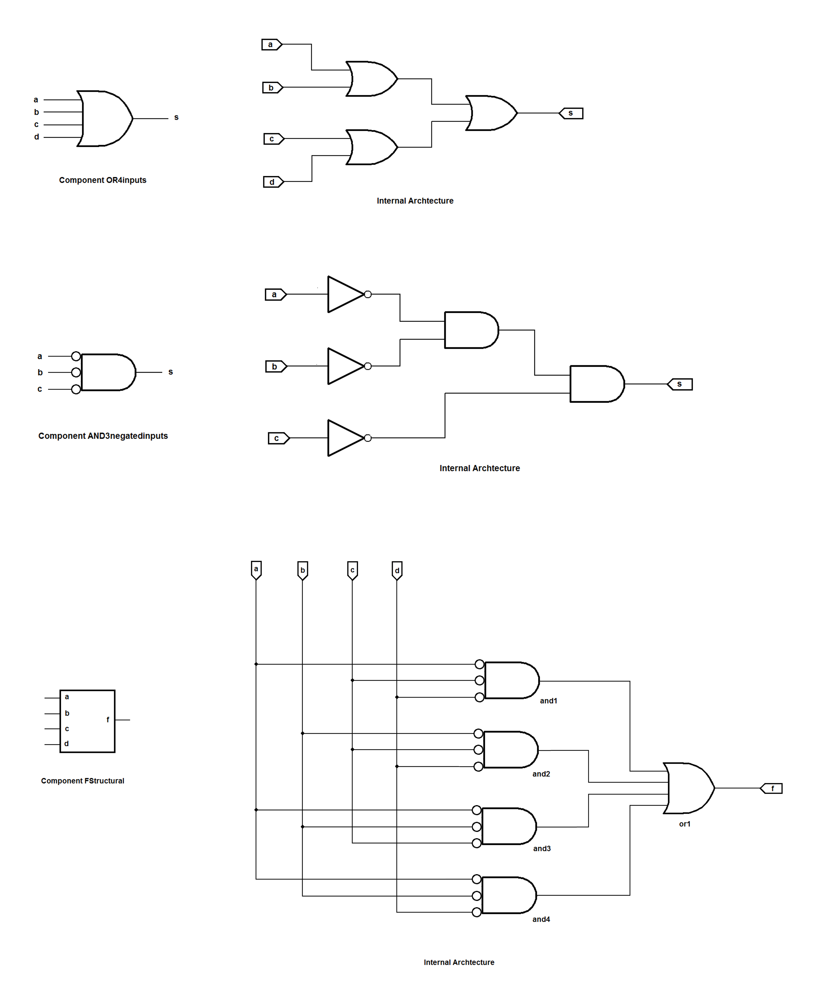
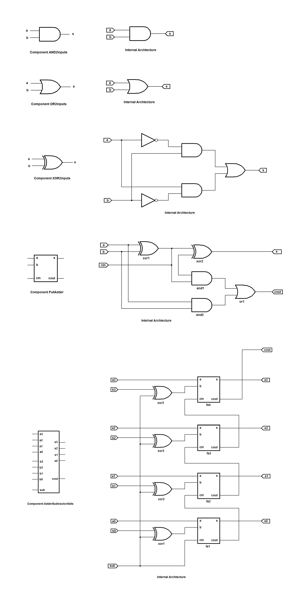
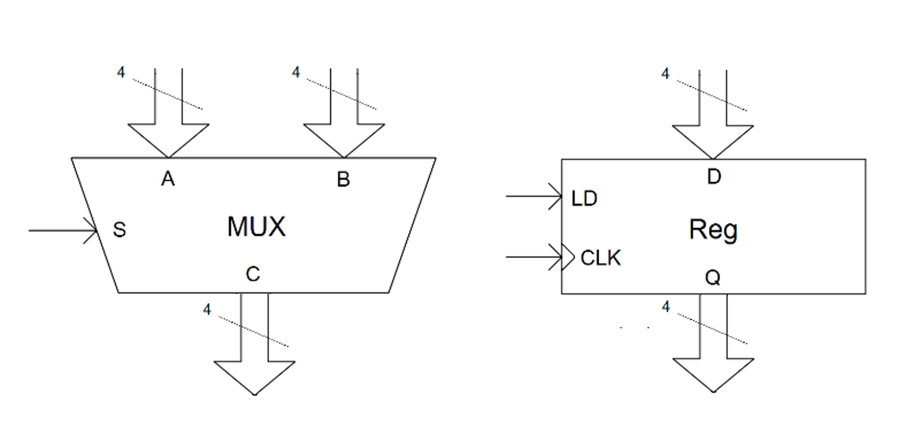
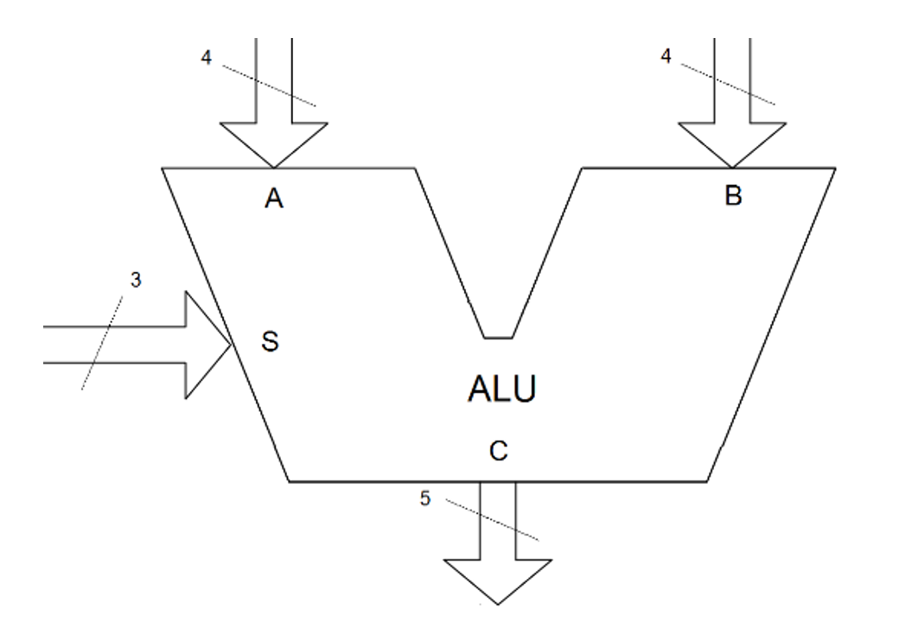
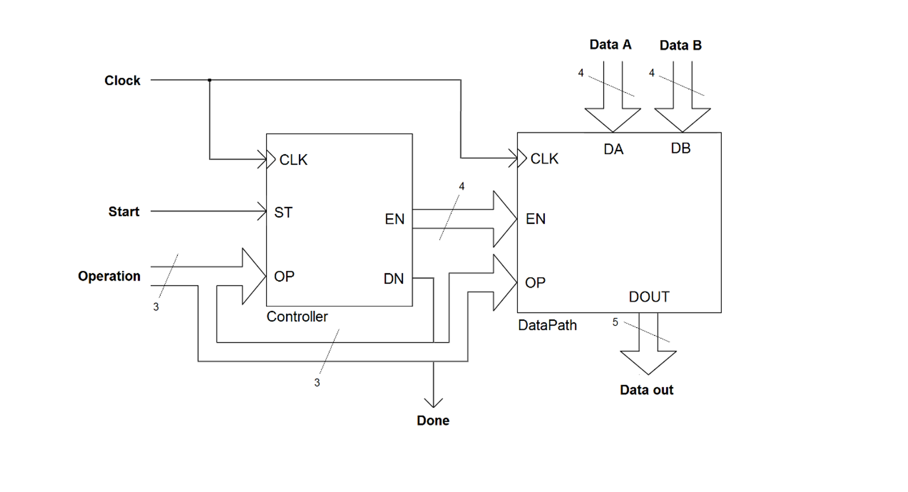

# MSOE | EE3900B Design of Logic Systems Labs

## About the Labs

This repository brings up an introductory series of implementations on how to design Logic Systems when dealing with FPGA's using VHDL as hardware description language. The concepts covered in this series help you to understand basics on structural style  behavioral style as well as implementing FSM-based components.

The series presented here is a throwback of a course called EE3900B Design of Logic Systems, taken by me as international student back in the Fall of 2014 at Milwaukee School of Engineering (MSOE). For this course, for testing implementations, it was used the DE1 Terasic Development Board which has a Cyclone II FPGA integrated circuit embedded on it. However the general concepts covered touch a lot of concepts that are common sense for lots applications, not only for building CPU components but also to build a wide variety of peripherals that can be integrated on developing digital systems.

## Table of Contents

The series requirements and content is shown in detail by the section for each lab. The following content topics present each lab's title to present to you a general idea of what it approached in this serie: 

* [Lab 01: Structural and Behavioral Styles](#lab-01-structural-and-behavioral-styles)
* [Lab 02: Adder-Subtractor](#lab-02-adder-subtractor)
* [Lab 03: FSM-based Components](#lab-03-fsm-based-components)
* [Lab 04: Washing Machine Controller](#lab-04-washing-machine-controller)
* [Lab 05: Multiplexers and Registers](#lab-05-multiplexers-and-registers)
* [Lab 06: Arithmetic Logic Units](lab-06-arithmetic-logic-units)
* [Lab 07: Datapaths](#lab-07-datapaths)
* [Lab 08: Control Units](#lab-08-control-units)
* [Lab 09: CPU Project Assembly](#lab-09-cpu-project-assembly)

## Lab 01: Structural and Behavioral Styles

##### Requirements: 

This lab introduces two styles of development commonly used to synthetize components using hardware description languages: Structural and Behavioral Styles. This lab doesn't go so far in this since that's just an introduction on the styles but it's going to be covered up by using that styles combined for creating mixed and more complex components in the next labs. 

Structural Style is known for being a technique that implements components by connecting multiple subcomponents. In this lab, it's shown how to implement examples of it combining logic gates into more complex components. The components assembled are shown in the components diagram.

Behavioral Style is known for being a technique that implements components by coding explicitly their behavior

##### Built with:

* VHDL Hardware Description Language
* Cyclone II FPGA  (Terasic DE1 Developing Board)

##### Components:

## Lab 02: Adder-Subtractor

This lab puts in practice concepts covered in the Lab 01 on Structural and Behavioral components to implement an Adder-Subtractor component. The implementation of this component is made in the two styles covered.

For the Structural Style, the Adder-Subtractor is made by implementing each logic gate (AND and OR logic gates) of it to reach components in higher levels of implementation (XOR logic gates and FullAdder components), and then to assembly that into a complet Adder-Subtractor component.

For the Behavioral Syle, the whole thing is made in a much easier way since it's possible to mimic the output behavior of an Adder-Subtractor for each given combination of inputs. So, it's possible to make it just looking at a truth table made for represent the component of interest. 

##### Requirements:

##### Built with:

* VHDL Hardware Description Language
* Cyclone II FPGA  (Terasic DE1 Developing Board)

##### Components:

## Lab 03: FSM-based Components

##### Requirements:

##### Built with:

* VHDL Hardware Description Language
* Cyclone II FPGA  (Terasic DE1 Developing Board)

##### Schematic:

## Lab 04: Washing Machine Controller

##### Requirements:

##### Built with:

* VHDL Hardware Description Language
* Cyclone II FPGA  (Terasic DE1 Developing Board)

##### Schematic:

## Lab 05: Multiplexers and Registers

##### Requirements:

In this Lab, it's shown how to implement two kind of components commonly used to compose digital systems: Multiplexers and Registers. These are examples of asynchronous and synchronous components respectively. 

For introducing multiplexers design, it was implemented a simple example of it by coding a asynchronous component with the function of selecting which group of 4 signals (A or B groups) would be available in the output (called C) each moment. This choosing is made by a single selecting line (called S). Multiplexers can be used to select group of lines available each moment. In CPU's, for examples, it select data to be stored by registers by datapaths from memory controllers, among many many other kinds of applications if can be used for. 

For introducing resisters design, it was implemented a simple example of it by coding a synchronous component. This components has the function of being in contact with a group of 4 signal lines (input group called D) and based on a LOAD signal (called LD) while sync clock is running (called CLK), it stores the state of the inputs into the output lines group (called Q), keeping this output state until the next LOAD signal activation. Registers are used widely in many kinds of applications to store data into a component based on a sync signal for posterior usage, making able to create complex synchronous components composed of combinations of multiple sync and async parts.

##### Built with:

* VHDL Hardware Description Language
* Cyclone II FPGA  (Terasic DE1 Developing Board)

##### Schematic:

## Lab 06: Arithmetic Logic Units

##### Requirements:

This lab shows a general idea of how it could be implemented an Arithimetic Logic Unit (ALU). ALU's are components commonly used in CPU's operate group of signals given as inputs, making possible the selection of the operation that would be applied on these inputs each time. The operations available in each ALU depends on the requirement of it.

For this lab in specific, given two groups of 4-line signals (A and B) and 5-line group as output (called C), it's possible to use the group of signals S as a selector for the following operations: 

Those operations were implemented as example, but other distinct operations could be implemented in that as a custom ALU.

##### Built with:

* VHDL Hardware Description Language
* Cyclone II FPGA  (Terasic DE1 Developing Board)

##### Schematic:

## Lab 07: Datapaths

##### Requirements:

This lab is about how to create synchronous datapaths for driving data into a routine of operations using a controller. The controller itself is going to be completed in the next lab since the tests oven the datapath made in this lab were performed manually using the mechanical switches in the DE1 Development Board.

The datapah presented here is a simplification of what is made for designing CPU's, where the datapath, driven by external sync signals (CLK for sync and EN for enabling each internal part), guides group of signals as data from registers inputs into a structure able to use them as operators in an ALU. The result is stored in a register output (as the signal DOUT).

##### Built with:

* VHDL Hardware Description Language
* Cyclone II FPGA  (Terasic DE1 Developing Board)

##### Schematic:

## Lab 08: Control Units

##### Requirements:

##### Built with:

* VHDL Hardware Description Language
* Cyclone II FPGA  (Terasic DE1 Developing Board)

##### Schematic:

## Lab 09: CPU Project Assembly

##### Requirements:

##### Built with:

* VHDL Hardware Description Language
* Cyclone II FPGA  (Terasic DE1 Developing Board)

##### Schematic:

